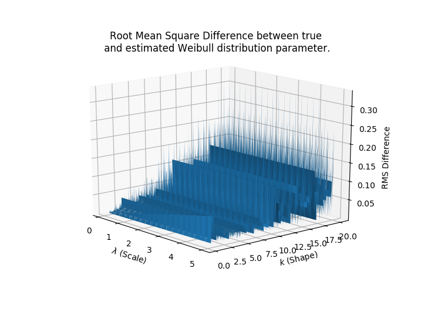

# python-weibullfit
MLE 2-parameter-Weibull distribution fit using MLE with numpy or pytorch.
Uses Newton-Raphson optimization.

### Estimation accuracy
Using PyTorch:

### Installation
For now, copy the `weibull` folder into your project directory to use it.

### How-To
Simply `import weibull` does the job. Subsequently you can use `weibull.fit(x)` 
to fit a weibull distribution to your data.

`import weibull` automatically attempts to load a `pytorch` implementation
to make use of efficient GPU-parallelization to decrease computation time.
An alternative `numpy` implementation is automatically loaded if `pytorch` fails to load.

### Good to know
`weibull.fit` accepts the following arguments:

 - `x`        1-dimensional ndarray from an (unknown distribution)
 - `iters`    Maximum number of iterations
 - `eps`      Stopping criterion. Fit is stopped if change within two iterations is smaller than eps.
 - `use_cuda` PyTorch version only. Enable or disable the GPU usage.
 
Each element `x_i` in `x` must satisfy: `x_i > 0`. Otherwise `NaN` is returned.